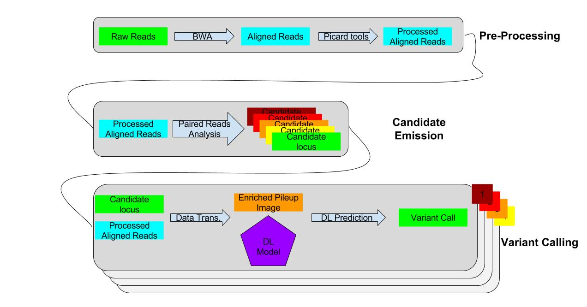

Happy new year !

# CrowdVariant

# DeepSV training and prediction mode

*Note*: Github does not support embedded LaTeX for now, thus this will render pootly there.
Compiling it with `pandoc` will be needed for having a proper renderring of the maths.

## Notation

Here we will denote to the _DeepSV classifier_ as $DS$, its application to a sample $DS(x) = \^{y}$.

Note that we will denote to the classifier the same way whether it is trained or untrained as it
should be obvious from the context (untrained in training, trained in prediction).

We will also refer to the data representation as _enriched pileup image (EPI)_.

## Training phase

The model is a simple classifier, it thus simply needs a set of labeled data, hopefully we can get
them on dbVar or directly from the GiaB consortium for some individuals.

### Positive labels

We generate the positive samples by reading the VCF file containing the known variants for a patient
(probably HG001 or HG002) or set of patients.

Once we know of these mutations we take the reads in the region of that variant (if the breakpoint
location is precise enough).

When we have the reads and the location we apply our transformation for having an enriched pileup
image.

We now have a set of labeled data for the positive class.

### Negative labels

For generating the negatives labels, we choose regions known to have no variants in the patients, of
varying sizes, and generate an enriched pileup image for that region.

We thus have a set of labaled data for the negative class.

*Note*: We can also use the false positives of other SV callers so that our method is trained to
classify them as true negatives, it may nevertheless be considered "cheating" to use this for the
benchmarking prooving that our method is superior, but it is still a good datapoint to give (as long
as we don't use this for claiming superiority).

### Actual training

Now that we have generated the data, we simply train our classifier with gradient descent and
backpropagation, the exact way to do that will be determined at implementation time (i.e.
regularization, fine tuning, early stopping, dropout, optimization algorithm, parameter
initilaization etc...).

## Prediction phase

For the prediction phase we generate an enriched pileup image for each candidate window and feed
that to our (trained) classifier.

The output of the classifier will be the prediction of our variant caller.

## Discussion

We may want to try to train our classifier on various technologies and species to see if transfer
learning is possible, and if we can use it to do discovery on new species.
