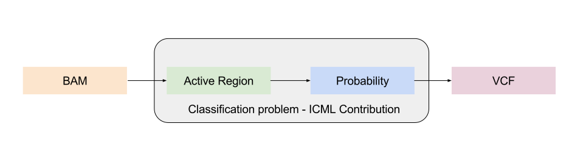
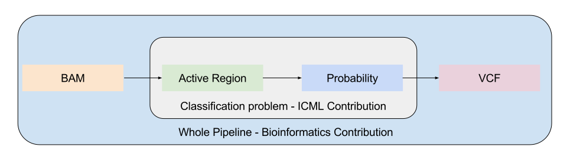

# Some schematics

# General structure of the ICML paper

Introduction (3 pages)

- Abstract + Why we care about structural variants and what our main contribution is. (0.5 page)
- Presentation of SVs and the general structure of a pipeline (1+ page)
- State of the art (0.5 page)
- How we difer and what lets us believe we are right (igv + svviz + crowdvariant), we show that the
  problem is an ML problem. (0.5 pages)

Method (2.5 pages)

- Signature of variants (half page figure)
- Explain why we reduce to the classification and not candidate emission (0.5 pages)
- Explain data representation, prove all signal is contained in our window (1 page)
- Generation of the data (also contribution ?) (0.5 pages)

Measurements (2 pages)

- Training procedure, allowing to tune sensitivity (by choosing confidence in the training data)
- Potential pretraining on SNPs (may not work).
- Big ass table with compariasions with SOTA, on different SV types, various sensitivity
- Some notes on how we (hopefully) beat them hands down.
- Show how it fares with more data: extrapolate for somatic variants

Conclusion, Further work (0.5 pages)

- Need to integrate in a full bioinformatics pipeline (follow up in bioinformatics 6 months later)
- Data representation can be used for other problems (TODO find which ones)
- Can lead to work on NN architectures for sequencing data (when more data is available).

## Pros

- Gives a nice introduction to the problem
- Readable by non bioinformaticians
- Extremely likely to beat the state of the art by a large margin
- Transdisciplinary
- A fair amount of hype on genomics, so they may be nicer.

## Cons

- No maths, like, at all... and ICML seems pretty theoretical
